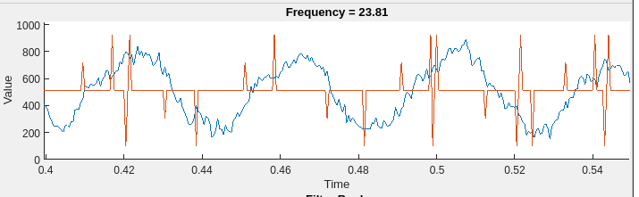
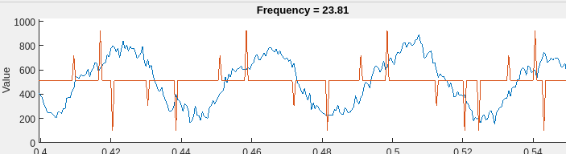
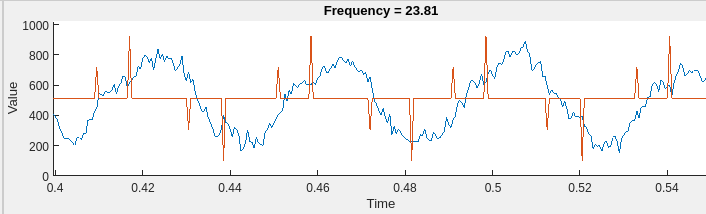

# Fixes
### Double Detection
Sometimes multiple events are detected in close proximity to each other.

**Solution 1**: Add a delay of samples in which another POI is prohibited from triggering.  
This works O.K but since the frequency of the signals varies so widely, even between banks, it is hard to catch them all.  

**Solution 2**: Dictate that POI must occur in a certain order, for instance peak, +/- cross, trough, -/+ zero cross and reject any detection out of that order.  

### False Detection
Sometimes multiple events are detected in close proximity to each other.

**Solution 1**: Instead of a 1 sample delay in detection, increase the lag to get more data points on either side of the peak/trough. Instead of 1 sample before and 1 sample after being compared to the peak, we could have 2 before and 2 after.  

**Solution 2**: Increase how many samples _after_ the peak/trough we keep track of. Currently only have 1 after and 1 before. This could increase to 3 after and 1 before!

### Band Switching
**Solution 1**: Require a band to be the highest band for 5-10 samples before it switches

