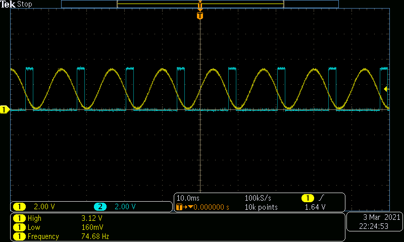

# Gamma Detection Using Teensy 4.0/4.1
### [J.D. Peiffer](mailto:jdp6n8@mail.missouri.edu), Ziao Chen, Satish Nair, Drew Headley

## Folder information
* __testing__: contains predefined input vectors (20-110 Hz chirp) for observation and testing.
    * __matlab__: contains matlab application to visualize output of testing script. Sample data is provided. Run "visualization_tool" in matlab.
* __main__: real time code with serial interface for setting threshold and triggering phase.
* __amplifier__: information for constructing input buffer circuit.
## Teensy Installation Instructions
* Download [Arduino IDE](https://www.arduino.cc/en/software)
* Download [Teensy Loader/Teensyduino](https://www.pjrc.com/teensy/loader.html)
    * This is a software add-on to the arduino software. All of the programming is done in Arduino IDE and Teensy Loader helps compile and upload code.
    * Most all Arduino functions like Serial.print() and digitalWrite() work with the teensy.

## Algorithm Description
1. With any serial input, the algorithm will halt and bring up the serial menu. It should look something like this:  

2. Type an option to change parameters. Type quit to run the algorithm.
3. Teensy reads from pin A6 (labeled 20) at a rate of 2 kHz.
4. Sample is inserted to __each__ of the four filter band's (20-50, 40-70, 60-90, 80-110 Hz) amplitude and phase filter.
5. Each band calculates its amplitude from amplitude filtered signal and phase from phase filtered signal. These numbers are all reported to the main function. 
6. The main function determines which band has the highest amplitude and reports the detected phase for that band. (A band must me the strongst band for over 50 samples, 25 ms, to be considered the "strongest". This prevents switching back and forth at the edge of bands.)
 7. If the desired phase is found in the strongest band, digital pin 2 (labeled 2) will be held at a high voltage for 2 samples (1 ms). This is editable by the user.
 8. Plug in serial USB to change triggering phase or threshold.
## I/O Pins
* __Analog pin 6__ (21 on teensy): input signal (0-3.3 V)
* __Digital pin 2__ (2 on teensy): written high for triggering 
* __Digital pin 1__ (1 on teensy): set high to supress triggering output
* __Ground__ (G on teensy): ground
* [Teensy 4.1 Pinout](https://www.pjrc.com/teensy/card11a_rev2_web.pdf)
* [Teensy 4.0 Pinout](https://www.pjrc.com/teensy/card10a_rev2_web.pdf)
## Sample images
Signal in yellow, trigger in blue. 95 Hz
  
Lower band at 35 Hz.
  
Detection for zero crossing.  
 
Trough Detection
 
Frequencies in between filter bands (45,65,85,105) show the most latency.

