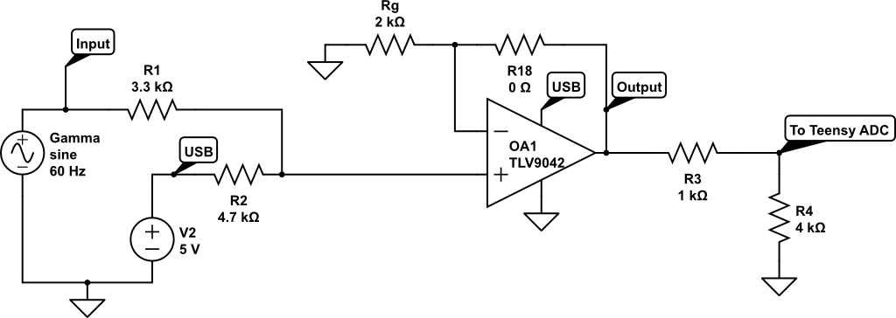
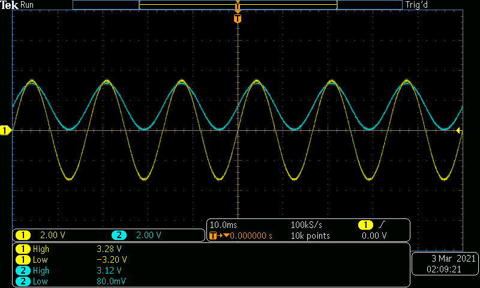

# Amplifier
Inputs: +/- 3.3 V AC, 5 V DC  
Outputs: 0 - 3.3 V AC  
## Parts
* [TLV9042IDR](https://www.ti.com/store/ti/en/p/product/?p=TLV9042IDR) 
* 3.3 kOhm resistor
* 4.7 kOhm resistor
* 2 kOhm resistor
* 1 kOhm resistor
* 4 kOhm resistor
* Optional [SOIC breakout board](https://www.adafruit.com/product/1212)

[The general layout of this circuit](https://www.circuitlab.com/circuit/dbz7m4fx69q8/clg-amplifier/) follows a non-inverting summing amplifier; however, the 4V output of the op-amp is attenuated with a voltage divider down to 3.3 V. The below image shows input in yellow and output in blue.  

